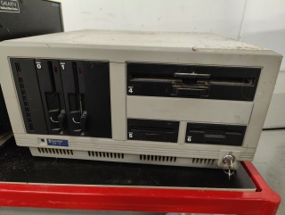
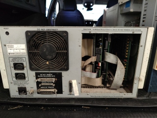

# Gemini DX-3

## Specification

* **Model Name:** Gemini DX-3
* **Model Number:** GM 946
* **Serial No.:** 946-004
* **Expansion Cards:** Unknown
* **Hard Drives:**
  * 2 x Unknown
* **Floppy Drives:**
  * 1 x 8" (Unknown geometry)
  * 1 x 5.25" (Unknown geometry - possibly 40 tracks DS-SD)
  * 1 x 5.25" (Unknown geometry - possibly 80 tracks DS-DD)
  * 1 x 3.5" (Unknown gemmetry - possibly DS-DD)
  * 1 x 3" (Unknown geometry)

## First Impressions

These photos were taken immediately after the rescue.

  ([Full size](20241127-Gemini-DX3-Front.jpg))

  ([Full size](20241127-Gemini-DX3-Back.jpg))
