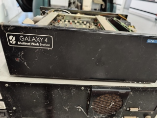
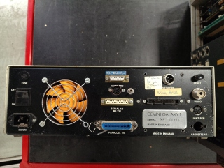
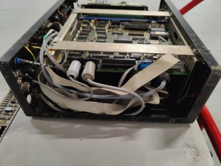
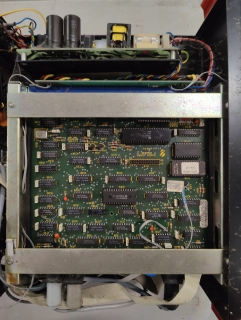

# Gemini Galaxy 1 - Multinet Work Station

## Specification

* **Model Name:** Gemini Galaxy 1 - Multinet Work Station
* **Model Number:** Unknown
* **Serial No.:** 00935
* **Hard Drives:** None
* **Floppy Drives:** None
* **Expansion Cards:** Unknown

## First Impressions

These photos were taken immediately after the rescue.

  ([Full size](20241127-Gemini-Galaxy-1-00935-Front.jpg))

  ([Full size](20241127-Gemini-Galaxy-1-00935-Back.jpg))

  ([Full size](20241127-Gemini-Galaxy-1-00935-Side.jpg))

  ([Full size](20241127-Gemini-Galaxy-1-00935-Top.jpg))
